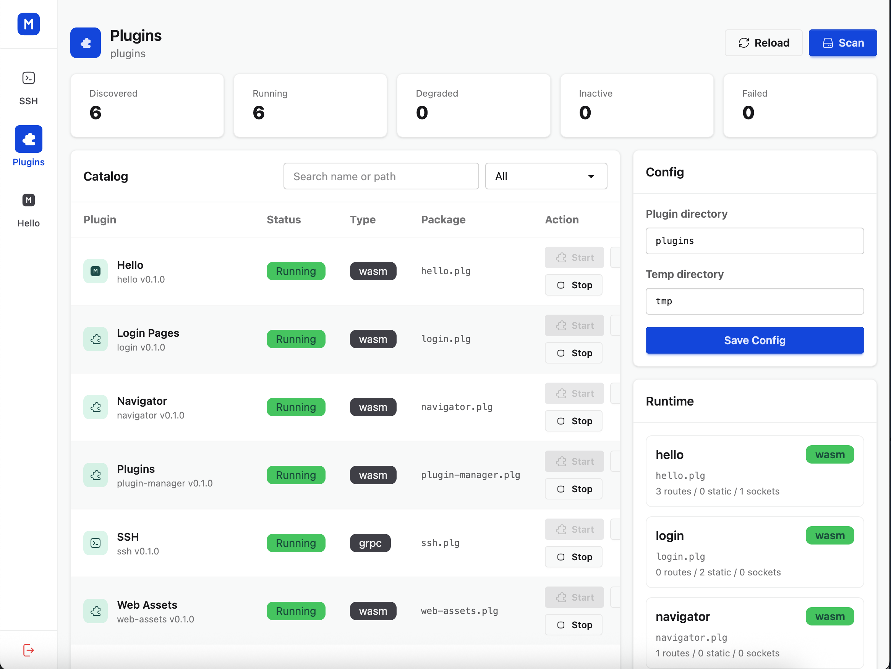

<h1>MinimalPanel</h1>

Server management panel written in Golang with a minimal kernel and a plugin system.

All features are implemented using plugins that can be written in any languages. 

### Roadmap

#### Core plugins
- [ ] Dashboard
- [x] Web SSH terminal
- [ ] File manager
- [ ] Speedtest